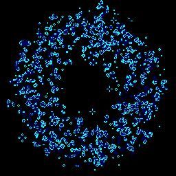

# life


> [View the demo][demo]

Any [cellular automaton] with rules [similar to][life-like] [Conway's Game of Life] can be modeled using a data structure similar to the following:
```js
let world = {
  time: 0
  rule: { birth: [ 3 ], survival: [ 2, 3 ] }
  size: [ 256, 256 ]
  data: new Uint8ClampedArray(256 * 256)
    .fill()
    .map(_ => Math.random() < 0.25)
}
```
The update function found in `lib/update.js` efficiently advances the given `world` by a single unit of time. Altering the rule, size, and seed of the above structure would enable you to simulate any cellular automaton with Life-like mechanics.

## license
[MIT][MIT license] © [Brandon Semilla][github]

[demo]:                  https://semibran.github.io/life/
[life-like]:             https://en.wikipedia.org/wiki/Life-like_cellular_automaton
[cellular automaton]:    https://en.wikipedia.org/wiki/Cellular_automaton
[conway's game of life]: https://en.wikipedia.org/wiki/Conway's_Game_of_Life
[MIT license]:           https://opensource.org/licenses/MIT
[github]:                https://github.com/semibran
